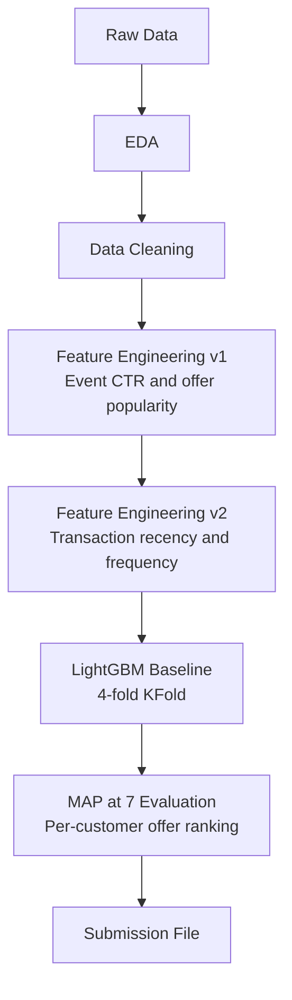

# Predictive Modeling for Digital Offer Click-Through 

**LightGBM ranking pipeline with multi-source feature engineering on 770K+ impression records**

---

## Overview

This repository contains the complete pipeline for the **American Express Campus Challenge (June 2025)** — a real-world offer recommendation problem. The task is to predict the click-through probability of digital financial offers shown to cardholders, and rank offers per customer to maximise **MAP@7** (Mean Average Precision at 7).

The pipeline spans three sequential notebooks:

| Notebook | Stage | Output |
|---|---|---|
| `processing and feature engineering 1.ipynb` | EDA + Data Cleaning + Feature Engineering v1 | `fe_v1_train.parquet`, `fe_v1_test.parquet` |
| `feature engineering 2.ipynb` | Transaction Feature Engineering v2 | `fe_v2_train.parquet`, `fe_v2_test.parquet` |
| `map score and submission.ipynb` | LightGBM Training + MAP@7 Evaluation + Submission | `r2_submission_amex.csv` |

---

## Problem Statement

American Express displays targeted digital offers to cardholders. The goal is to predict which offers a customer will click, enabling more relevant offer ranking.

| Property | Detail |
|---|---|
| Task | Binary click prediction + per-customer offer ranking |
| Evaluation metric | MAP@7 (Mean Average Precision at 7) |
| Target variable | `y` — binary click indicator |
| Class imbalance | Overall CTR: **4.81%** (severe imbalance) |
| Scale | 770K train rows, 369K test rows, 370+ features |

---

## Dataset

| File | Rows | Columns | Size | Description |
|---|---|---|---|---|
| `train_data.parquet` | 770,164 | 372 | ~14.7 GB | Impression-level training data with click labels |
| `test_data.parquet` | 369,301 | 371 | ~7.2 GB | Impression-level test data |
| `offer_metadata.parquet` | 4,164 | 12 | ~2 MB | Offer attributes (discount rate etc.) |
| `add_event.parquet` | 21,457,473 | 5 | ~4.8 GB | Historical impression and click event log |
| `add_trans.parquet` | 6,339,465 | 9 | ~2.7 GB | Customer transaction history |

> Dataset is not included. It was provided privately as part of the AMEX Campus Challenge on Kaggle.

---

## Pipeline Architecture



---

## Feature Engineering

### Stage 1 — Event-Based Features (v1)

Aggregated from 21M+ historical impression/click events:

| Feature | Description |
|---|---|
| `imp_cnt` | Total impressions for customer × offer pair |
| `click_cnt` | Total clicks for customer × offer pair |
| `ctr_id2_id3` | Historical CTR for customer × offer pair |
| `offer_imp_cnt` | Global impression count for the offer |
| `offer_click_cnt` | Global click count for the offer |
| `offer_ctr` | Global CTR for the offer (offer popularity) |
| `cust_imp_cnt` | Total impressions received by the customer |
| `cust_click_cnt` | Total clicks by the customer |
| `cust_ctr` | Customer's historical engagement rate |

### Stage 2 — Transaction-Based Features (v2)

Aggregated from 6.3M+ transaction records:

| Feature | Description |
|---|---|
| `trans_count` | Number of transactions per customer |
| `trans_total_amt` | Total transaction amount per customer |
| `trans_avg_amt` | Average transaction amount per customer |
| `trans_recency_days` | Days since last transaction at impression time |

**Total engineered features: 20** (on top of 370+ raw features)

---

## Model

### LightGBM Baseline

| Parameter | Value |
|---|---|
| Objective | Binary classification |
| Metric | Binary log-loss (early stopping) |
| Learning rate | 0.05 |
| Num leaves | 64 |
| Feature fraction | 0.8 |
| Bagging fraction | 0.8 |
| Bagging frequency | 1 |
| Cross-validation | 4-fold KFold (time-aware, no shuffle) |
| Early stopping | 100 rounds |

Predictions are averaged across 4 folds for the test set. Out-of-fold (OOF) predictions are used for MAP@7 evaluation.

### MAP@7 Scoring

```python
# Per customer: rank offers by predicted click probability
# Compute Average Precision at 7 against true clicked offers
# MAP@7 = mean of per-customer AP@7 scores
CV MAP@7 = 0.04832
```

> Note: MAP@7 is a ranking metric sensitive to class imbalance. With a 4.81% CTR, absolute MAP@7 values are inherently low. The competition ranks submissions relatively.

---

## Results

| Metric | Value |
|---|---|
| CV MAP@7 (4-fold OOF) | **0.04832** |
| Binary log-loss (Fold 1) | 0.1164 (87 rounds) |
| Binary log-loss (Fold 2) | 0.1080 (101 rounds) |
| Binary log-loss (Fold 3) | 0.0903 (194 rounds) |
| Binary log-loss (Fold 4) | 0.1135 (88 rounds) |
| Overall CTR (train) | 4.81% |
| Training set size | 770,164 rows |

---

## Project Structure

```
Decision-Science-Track/
│
├── processing and feature engineering 1.ipynb   # EDA + cleaning + FE v1
├── feature engineering 2.ipynb                  # Transaction FE v2
├── map score and submission.ipynb                # LightGBM + MAP@7 + submission
└── README.md
```

---

## Notebook Execution Order

```
1. processing and feature engineering 1.ipynb
   → Outputs: train_clean.parquet, test_clean.parquet, fe_v1_train.parquet, fe_v1_test.parquet

2. feature engineering 2.ipynb
   → Inputs:  fe_v1_train.parquet, fe_v1_test.parquet
   → Outputs: fe_v2_train.parquet, fe_v2_test.parquet

3. map score and submission.ipynb
   → Inputs:  fe_v2_train.parquet, fe_v2_test.parquet
   → Outputs: lgbm_baseline.pkl, oof_preds.csv, r2_submission_amex.csv
```

> All notebooks were run on Kaggle (CPU, Python 3.11). The dataset must be attached as a Kaggle dataset named `amexda`.

---

## Key Engineering Decisions

| Decision | Rationale |
|---|---|
| KFold without shuffle | Preserves temporal ordering of impressions to prevent data leakage |
| OOF predictions for MAP@7 | Gives an unbiased estimate of ranking quality before submission |
| Median imputation for numerics, mode for categoricals | Conservative strategy for 23% missing values across 370+ features |
| Memory downcasting (float32, int8) | Reduced RAM usage on datasets totalling ~29 GB |
| Fast-path skip (`sys.exit` if outputs exist) | Avoids expensive re-computation on Kaggle's stateless kernel restarts |

---

## Future Improvements

| Improvement | Expected Impact |
|---|---|
| Target encoding for high-cardinality categorical features | Capture category-level CTR signal without one-hot explosion |
| Time-based cross-validation (GroupKFold by date) | More realistic evaluation aligned with deployment scenario |
| XGBoost / CatBoost ensemble | Reduce variance via model diversity |
| Offer metadata features (discount rate, category) | Incorporate supply-side signals currently unused |
| Negative sampling to handle 4.81% CTR imbalance | Improve calibration of predicted probabilities |
| Customer segmentation features (RFM clustering) | Richer behavioural profiles beyond aggregate CTR |

---

## Lessons Learned

- **MAP@7 rewards ranking, not calibration** — a model with better log-loss does not necessarily achieve better MAP@7; the relative ordering of offers per customer matters more than absolute probability values.
- **Event log aggregation is the highest-signal step** — customer × offer historical CTR from 21M events was the single most informative feature group.
- **Memory management is a first-class constraint** — at 29 GB of raw data, downcasting and selective column loading (`columns=` in `read_parquet`) were necessary to avoid OOM on Kaggle's 16 GB RAM limit.
- **Temporal leakage is easy to introduce** — using `shuffle=False` in KFold and computing recency relative to the impression timestamp (not globally) were critical correctness decisions.

---

## References

| Resource | Link |
|---|---|
| LightGBM Documentation | https://lightgbm.readthedocs.io |
| MAP@K metric explanation | https://www.kaggle.com/code/debarshichanda/map-at-k |
| pandas read_parquet | https://pandas.pydata.org/docs/reference/api/pandas.read_parquet.html |
| AMEX Campus Challenge | Kaggle (private competition) |
